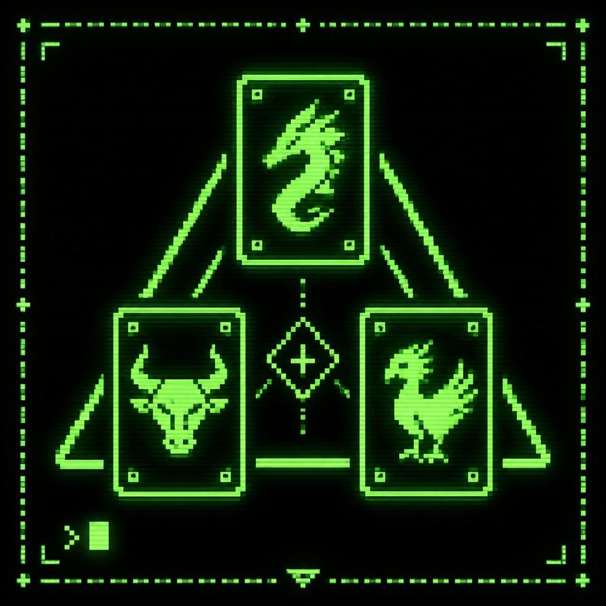

# Triple-triad

<p align="center">
  
</p>

<p align="center">
  <a href="https://pypi.org/project/triple-triad-ff8/"></a>
  <a href="https://pypi.org/project/triple-triad-ff8/"></a>
  
</p>

A terminal-based Python implementation of the classic **Triple Triad** card game from *Final Fantasy VIII*, complete card collection with the clasical rules

---

## ✨ Features

- **110 cards from FFVIII**
- **Chiptune music** — Retro-style background music generated with NumPy and played through pygame-ce
- **Interactive deck builder** — Browse, filter, and sort all cards before picking your hand

---

## 🎮 How to Play

Triple Triad is a 2-player card game played on a 3×3 grid. Each player has 5 cards. Players take turns placing one card on the board. When a card is placed adjacent to an opponent's card, the touching sides are compared — if the attacker's value is higher, the defender's card is captured. The player with the most cards on the board at the end wins.

```
 ┌──────────────────┬──────────────────┬──────────────────┐
 │                  │                  │                  │
 │     [ 1 ]        │     [ 2 ]        │     [ 3 ]        │
 │                  │                  │                  │
 ├──────────────────┼──────────────────┼──────────────────┤
 │ ■Ifrit           │                  │                  │
 │      ▲ 9         │     [ 5 ]        │     [ 6 ]        │
 │ ◀ 5   Ice   8 ▶  │                  │                  │
 │      ▼ 6         │                  │                  │
 ├──────────────────┼──────────────────┼──────────────────┤
 │ □Shiva           │                  │                  │
 │      ▲ 6         │     [ 8 ]        │     [ 9 ]        │
 │ ◀ 6   Ice   9 ▶  │                  │                  │
 │      ▼ 7         │                  │                  │
 └──────────────────┴──────────────────┴──────────────────┘
```

- **■** = Your card
- **□** = CPU's card
- Numbers inside empty cells = board position (1–9)

---

## 🚀 Getting Started

### Prerequisites

- **Python 3.13+**
- **NumPy** (for audio synthesis)
- **pygame-ce** (for audio playback — optional, game runs silently without it)

### Installation from PyPI

Using pip:

```bash
pip install triple-triad-ff8
```

Using uv:

```bash
uv pip install triple-triad-ff8
```

### Installation from Source

```bash
git clone https://github.com/fernando24164/triple-triad-ff8.git
cd triple-triad-ff8
uv sync --locked
```

### Run the Game

```bash
python -m triple_triad
```

or

```bash
uv run triple-triad
```

or if installed via pip:

```bash
triple-triad
```

### Help and Tutorial

To view the game tutorial and learn how to play:

```bash
triple-triad --help
```

or

```bash
triple-triad -h
```

This displays a comprehensive guide covering game rules, card mechanics, and gameplay tips.


## 🎵 Audio

The game includes a built-in chiptune soundtrack synthesized entirely in software:

- **Generated with NumPy** — no audio files required
- **Played through pygame-ce** — if pygame-ce is unavailable, the game runs silently

---

## 🧩 Rules

| Rule | Description |
|------|-------------|
| **Open** | CPU's hand is visible to the player |
| **Same** | If 2+ adjacent cards share equal values, all are captured |
| **Plus** | If 2+ adjacent cards share equal value *sums*, all are captured |
| **Random** | Cards are dealt randomly from the full pool |

---

## 🛠 Development

### Install Dev Dependencies

```bash
uv sync --locked
```

### Run Tests

```bash
uv run pytest
```

### Lint

```bash
uv run ruff check .
```

---

## 🌐 Multiplayer (P2P)

Triple Triad supports **direct peer-to-peer** multiplayer over TCP.

### How it works

1. **Host** starts a lobby on a chosen port (default `64000`).
2. **Guest** connects using the host's IP address and port.
3. The game synchronises rules, board elements, and decks before starting.

### ⚠️ NAT / Firewall Limitations

The current P2P implementation uses **direct TCP connections** 

| Scenario | Works? |
|----------|--------|
| Both players on the same local network | ✅ |
| Host has a public IP or port forwarding configured | ✅ |

**Workarounds:**

- **Port forwarding** — Configure your router to forward the chosen port (default `64000`) to the host machine.
- **LAN play** — Both players on the same local network work without any configuration.
- **VPN** — Use a VPN (e.g. Tailscale, ZeroTier, Hamachi) to create a virtual LAN.

## 🤝 Contributing

Contributions are welcome! Here's how to get started:

1. **Fork** the repository
2. **Create a feature branch** — `git checkout -b feature/my-feature`
3. **Make your changes** — follow the existing code style
4. **Run tests** — `pytest`
5. **Submit a pull request**

Please open an issue first for major changes to discuss the approach.

---

## Build

```sh
uv build
```

```sh
twine upload dist/*
```

## 📄 License

This project is for educational and personal use. Triple Triad is a minigame from *Final Fantasy VIII*, © Square Enix. All card names and game mechanics are the property of their respective owners.